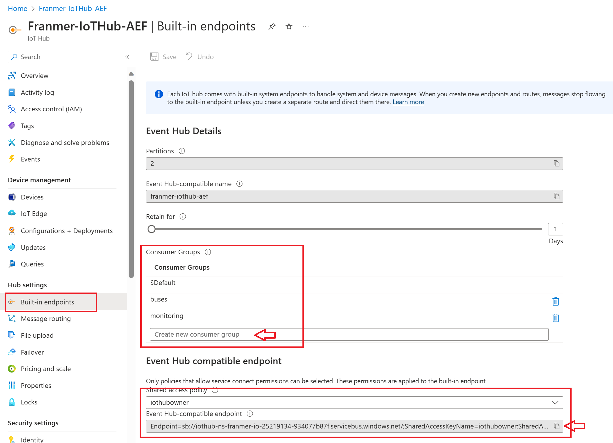
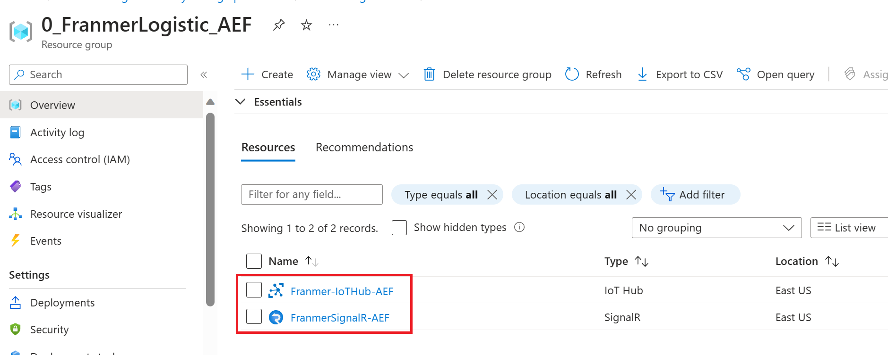
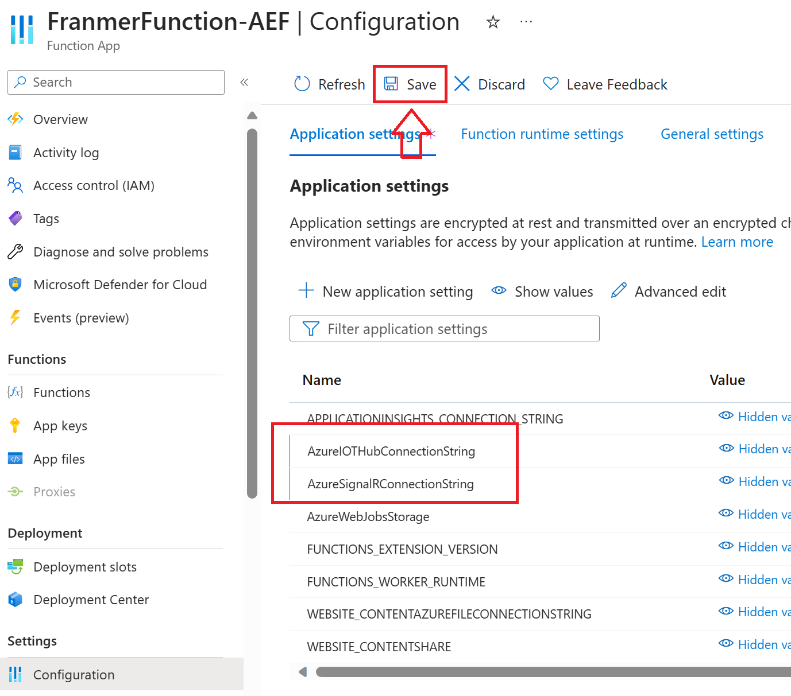
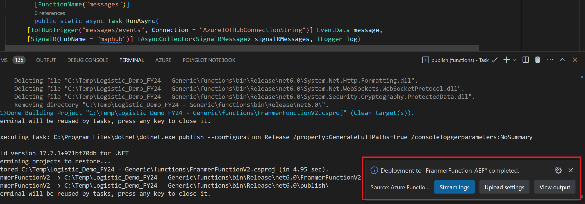
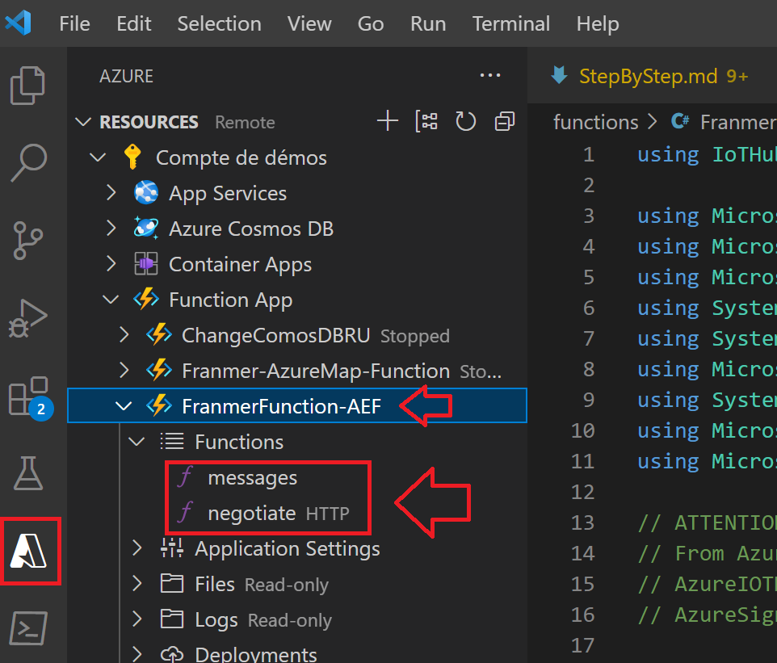
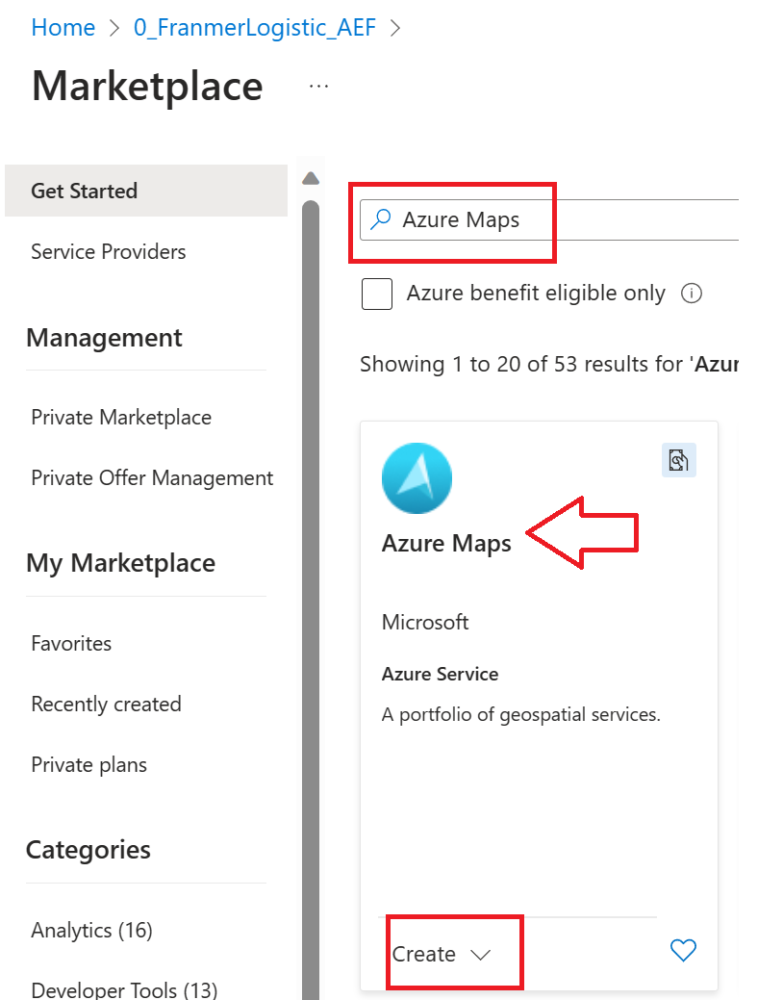
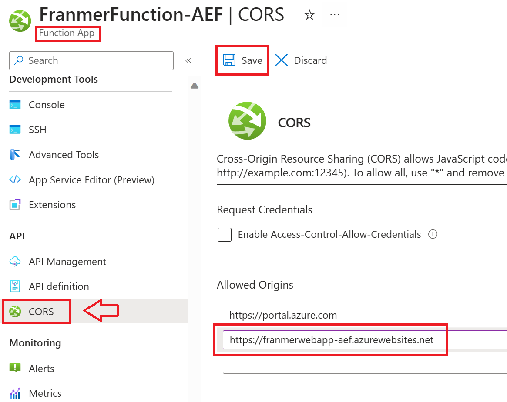
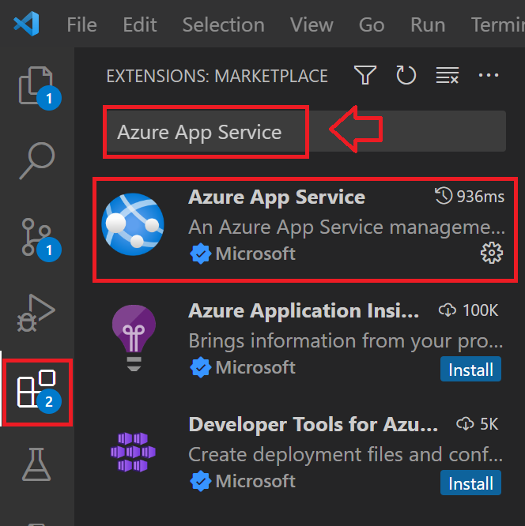

# Real-time logistics monitoring

In this article, I will present the steps to set up, from start to finish, a solution for monitoring a fleet of vehicles in real time. 

After following this article, you will have a complete solution as illustrated in the animated gif below:

## Prerequisites

- An Azure [subscription](https://azure.microsoft.com/en-ca/free/)
- [Visual Studio Code](https://code.visualstudio.com/download)
- [Azure CLI](https://docs.microsoft.com/en-us/cli/azure/install-azure-cli)
- [IoT Explorer](https://github.com/Azure/azure-iot-explorer/releases)

## Ingestion

The first step is to ingest the data into our solution. IoT Hub is the service used to receive events and enable other Azure services to subscribe and receive those events. An event is simply a set of data, which in our case is represented vehicle information (id, location, occupancy, transit status,....)

### IoT Hub

From the [Azure portal](https://portal.azure.com), in the marketplace, search for the Azure IoT Hub service, and then click "*Create*":

Fill in the information. The basic tier will be sufficient here. However, it may be increased at a later date as required.

Click on "*Review + Create*" and validate the creation of the service:

Once the service is created, go to its "*Overview*" page and update the certificate right away. Click on the link "*What do I need to do?*":

Click on the "*Migrate to DigiCert Global G2*" button:

Then check the 4 boxes before clicking on the "*Update*" button:

.

#### Creating a device

At your Azure IoT Hub service level, on the left, click "*Devices*" and then "*Add Device*"

Give the device a name, choose "*Symetric key*", check the "*Auto-generate keys*" box and check that the "*Enable*" option is selected.

Click on "*Save*"

Click "*Refresh*" to see your device in the list

#### Creation of consumer groups

Consumer groups are a status view of the hub. They allow multiple consuming applications to each have their own view of the event stream and read the stream independently. This means that when an application stops reading from an event stream, it can continue where it left off. It is best for each app to have its own group of consumers.

On the left, click on "Built-in endpoints", then create your consumer groups.

Copy the connection string "*Event Hub-compatible endpoint*" and keep it in an array. It will be used a little later.

#### Creating a "*SAS TOKEN*"

To connect to our IoT Hub with IoT Explorer we need a connection string.

On the left click on "*Shared access policies*", "*iothubowner*", then copy one of the connection strings.

For the creation of the login token, we will use [IoT Explorer](https://github.com/Azure/azure-iot-explorer/releases).

Run IoT Explorer and click "*Add connection*":

Paste the connection string and click "*Save*":

You should then see the devices present in your IoT Hub. Click on one of the devices:

In the "*Connection string with SAS token*" section, choose "*Primary key*", set the number of minutes (525,600 minutes = 1 year) for the token to expire, and then click "*Generate*".

You'll get a token similar to the one below:

*HostName=IoTHub-Logictic-AEffacer.azure-devices.net;DeviceId=FranmerBuses; SharedAccessSignature=SharedAccessSignature sr=IoTHub-Logictic-AEffacer.azure-devices.net%2Fdevices%2FFranmerBuses&sig=Qq0GFga6kzgwHp0DldvpJbR1mwAwXMOAm6Lmc9UFBhQ%3D&se=2392799555*

**Keep only the portion beginning with "*SharedAccessSignature sr=*" as shown below:**

*SharedAccessSignature sr=IoTHub-Logictic-AEffacer.azure-devices.net%2Fdevices%2FFranmerBuses&sig=Qq0GFga6kzgwHp0DldvpJbR1mwAwXMOAm6Lmc9UFBhQ%3D&se=2392799555*

Copy the generated portion and paste it. We're going to need it later.

#### Send events to Azure IoT Hub

From Visual Studio code, open the "*SendVehicleEvent.py*" file and fill in the required fields.

For the value "*YOUR FILE PATH*", go to the "*data*", then right-click on the file "*BusPositionV2.csv*" and click on "*Copy Path*":

After editing, you should get something as shown below:

Once the changes are made, run the code. If all goes well you should see the events in the terminal:

#### Checking sent events

We'll verify that events happen in our Azure IoT Hub

##### With Azure CLI

Open a "Command prompt" window and connect to the correct Azure tenant with the following command:

az login --tenant <Your Tenant ID>

Once connected to the correct tenant, run the following command (Here we will use one of the consumer groups we created earlier):

az IoT hub monitor-events -n {iothub_name} -d {device_id} -g {resource_group} --cg {consumer_group_name}

If all goes well, once the Azure CLI command is executed you should see the events that enter Azure IoT Hub:

#### Azure IoT Explorer

You can also monitor incoming events with Azure IoT Explorer:

## Event Processing

Now that the events are ingested into Azure IoT hub, we'll retrieve them for action.

### SignalR

The Azure SignalR service simplifies the process of adding real-time web capabilities to applications over HTTP. This real-time feature allows the service to send content updates to connected clients, such as a web or mobile app. Therefore, clients are updated without having to query the server or send new HTTP update requests.

From the Azure portal, click "*Create a resource*"

Then search for the SignalR service:

Fill in the information to create your service. Choose the resource group where you want to deploy the service.
To try, you can choose the "*Free*" tier.

Choose "***Serverless***" for the service mode.

Click on "*Review + create*"

Validate the creation of the service by clicking on the "*Create*" button

You should now have 2 services in your resource group:

Click your SignalR service, then click "*Connection strings*" to retrieve the connection string. Copy it and paste it into a file. We will need it a little later.

### Azure Function

We will now create an "*Azure Function App*" to retrieve events from Azure IoT hub and ensure real-time communication with Azure Maps (which we will deploy a little later)

From the Azure portal, create a new resource and search for "*Function App*":

Set the options as shown in the screenshot below and click on "*Review + create*", then validate the creation of the "*Function App*":

From the Azure portal, go to your resource group and click on the newly deployed "*Function App*":

Then click on "Configuration. In "application settings" click on "New application setting"

Add the values:

- AzureIOTHubConnectionString
- AzureSignalRConnectionString

For the value "*AzureIOTHubConnectionString*" fill in the value of the connection string for IoT Hub (*Event Hub-compatible endpoint*):

For the value "*AzureSignalRConnectionString*" specify the connection string of the SignalR service: 

Don't forget to save your changes by clicking on the "*Save*" button:

#### Code deployment

We will deploy the function code from Visual Studio Code. First, make sure you're signed in to Azure:

Once signed in, you should see your Azure resources:

the code is located in the "*Functions*" folder. This is the file "*FranmerRealTimeLogistic.cs*". Click the file, and then from the command palette (Ctrl + Shift + P), select "*Azure Functions: Deploy to Function App... *" 

Then select your "*Function App*":

Validate the update:

If all goes well, you should get this message at the end of the deployment:

And you should see your 2 functions deployed in Azure:

## Serve and present

Now we will deploy the services to serve and present the information

### Azure Maps

Azure Maps is a collection of geospatial services and SDKs that use up-to-date map data to provide accurate geographic context for web and mobile applications. Azure Maps provides the following services:

- REST API to render vector and raster maps in multiple styles and satellite imagery.
- Creator services to create and display maps based on private interior map data.
- Search services to locate addresses, places and points of interest worldwide.
- Various routing options: point-to-point, multipoint, multipoint optimization, isochronous, electric vehicle, commercial vehicle, influenced traffic and matrix routing.
- Traffic flow view and incident view for applications that need real-time traffic information.
- Time zone (*Time zone*) and geolocation (*Geolocation*) services.
- *geofencing* services and map data storage, with location information hosted in Azure.
- Geographic intelligence via geospatial analytics.

The Azure Maps solution shown here includes clustering and dynamic pop-ups.

#### Deploying Azure Maps

From the Azure portal, create a new resource and search for Azure Maps. Click on "*Create*":

Fill in the necessary information. For the price tier, choose "*Gen2 (Maps and Location Insights)*": 

Once the service is deployed, from the Azure portal, click on your Azure Maps service, and then click "*Authentication*". Copy the primary key of the service and copy it to a file. We will need it a little later:

### Azure Web App

Azure App Service is an HTTP service for hosting web apps, REST APIs, and mobile backends. You can develop in your preferred language, namely .NET, .NET Core, Java, Node.js, PHP and Python. Applications run and scale easily in Windows and Linux environments.

#### Azure Web App deployment

From the Azure portal, create a new resource and search for Azure Web App:

Fill in the necessary information. For the following fields, set the values as shown below:

- Publish: "Code"
- Runtime stack: "PHP 8.2"
- Pricing plan: "Free"

Click on "Review + Create" and validate the creation of the service:

Once the service is deployed, go to the "Overview" page of your Azure Web App service and copy the "*Default Domain*" value. Copy this value to a file, we will need it a little later:

### Deployment

After all Azure services are deployed, you should have the following services in your resource group:

#### Azure Function CORS definition

In order to allow the Azure Maps Service to communicate with Azure functions, there is one last configuration to be made at the Azure level "*Function App*".

At your "*Function App*", click on "*CORS*" ("Cross-Origin Resource Sharing") and add the URL of your web application that you copied earlier:

#### Modifying the web application code

From Visual Studio Code, verify that you have the "*Azure App Service*" add-in:

Go back to the "*Explorer*" part of Visual Studio Code, in the "*Web*" folder click the "*Index.html*" file. Replace the following values:

- baseurl (the url of your Azure Function App)
- subscriptionKey (the key to your Azure Maps service)

For example you should get something like below after modifications:

In addition, change the references, with the url of your web application, to images or services, where appropriate, as shown below:

For images:

For features:

#### Web Application Deployment

From Visual Studio Code, in the Azure part, verify that you have access to your web application.

Right-click on your web application and click on "*Deploy to Web App... *" :

The command palette will open at the top of the screen. Click "*Browse...*" to select the folder you want to deploy:

In our case we will deploy the "*Web*" folder. **Double-click** on the "*Web*" folder and click "*Select*":

Click on "*Deploy*":

If all goes well, you should have the message below at the bottom right of your screen. Click on "*Browse Website*":

You should have a new tab opening in your web browser displaying a map focused on Montreal:

#### Follow buses in real time

We will now send events to IoT Hub to display them in near real-time on our Azure Maps.

In the Visual Studio Code File Explorer, click "*SendVehicleEvents.py*" which is located in the "*producer*" folder. Click on the "*play*" button at the top right of the screen:

You should see events in the console:

You should see the buses start moving on the map:

Below is a small animated Gif to illustrate the solution with clustering, event-based color management and dynamic pop-ups:

## How to debug

After publishing your web page, in your web browser, press the **F12** key and scan for returned errors.

Below is an example of common errors with poor image reference and misconfiguration of "*applications settings*" at the Azure "*Function App*" level:

