# Real-time logistics monitoring

In this article, I will present the steps to set up, from start to finish, a solution for monitoring a fleet of vehicles in real time. 

After following this article, you will have a complete solution as illustrated in the animated gif below:

## Prerequisites

- An Azure [subscription](https://azure.microsoft.com/en-ca/free/)
- [Visual Studio Code](https://code.visualstudio.com/download)
- [Azure CLI](https://docs.microsoft.com/en-us/cli/azure/install-azure-cli)
- [IoT Explorer](https://github.com/Azure/azure-iot-explorer/releases)

## Ingestion

The first step is to ingest the data into our solution. IoT Hub is the service used to receive events and enable other Azure services to subscribe and receive those events. An event is simply a set of data, which in our case is represented vehicle information (id, location, occupancy, transit status,....)

### IoT Hub

From the [Azure portal](https://portal.azure.com), in the marketplace, search for the Azure IoT Hub service, and then click "*Create*":

Fill in the information. The basic tier will be sufficient here. However, it may be increased at a later date as required.

Click on "*Review + Create*" and validate the creation of the service:

Once the service is created, go to its "*Overview*" page and update the certificate right away. Click on the link "*What do I need to do?*":

Click on the "*Migrate to DigiCert Global G2*" button:

Then check the 4 boxes before clicking on the "*Update*" button:

! [IoTHub](pictures/005.png).

#### Creating a device

At your Azure IoT Hub service level, on the left, click "*Devices*" and then "*Add Device*"

Give the device a name, choose "*Symetric key*", check the "*Auto-generate keys*" box and check that the "*Enable*" option is selected.

Click on "*Save*"

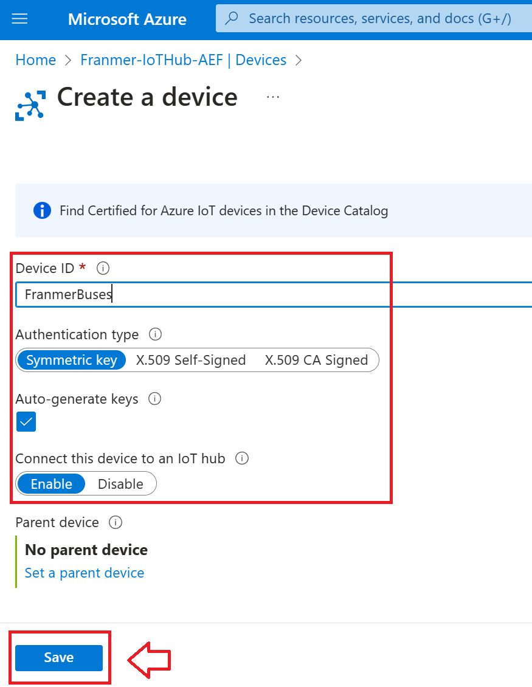

Click "*Refresh*" to see your device in the list

#### Creation of consumer groups

Consumer groups are a status view of the hub. They allow multiple consuming applications to each have their own view of the event stream and read the stream independently. This means that when an application stops reading from an event stream, it can continue where it left off. It is best for each app to have its own group of consumers.

On the left, click on "Built-in endpoints", then create your consumer groups.

Copy the connection string "*Event Hub-compatible endpoint*" and keep it in an array. It will be used a little later.

! [IoTHub] (pictures/009.png)

#### Creating a "*SAS TOKEN*"

To connect to our IoT Hub with IoT Explorer we need a connection string.

On the left click on "*Shared access policies*", "*iothubowner*", then copy one of the connection strings.

For the creation of the login token, we will use [IoT Explorer](https://github.com/Azure/azure-iot-explorer/releases).

Run IoT Explorer and click "*Add connection*":

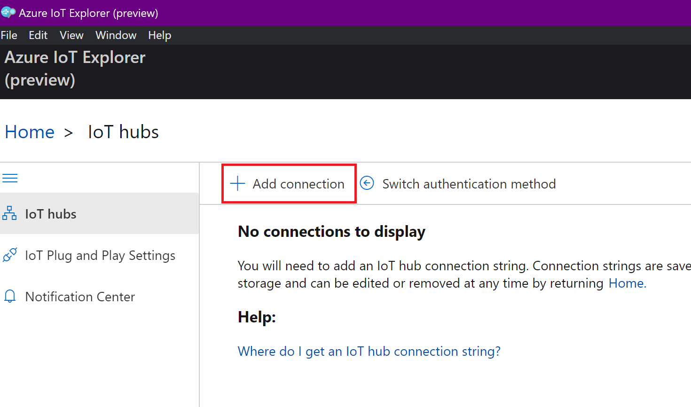

Paste the connection string and click "*Save*":

You should then see the devices present in your IoT Hub. Click on one of the devices:

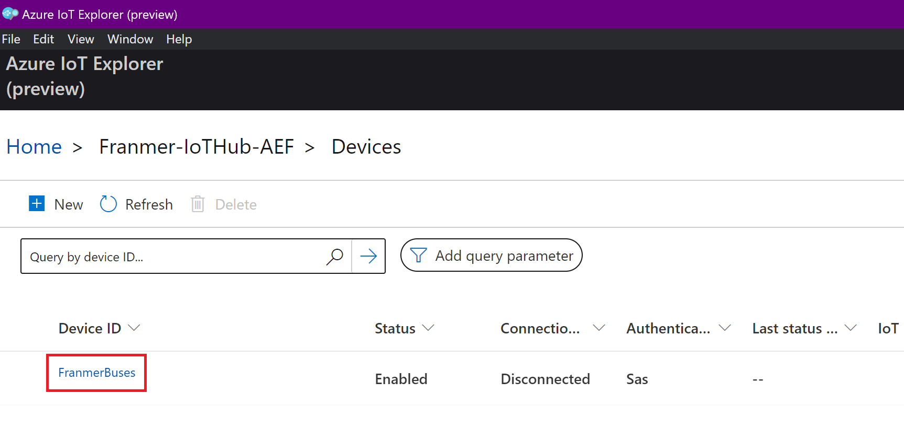

In the "*Connection string with SAS token*" section, choose "*Primary key*", set the number of minutes (525,600 minutes = 1 year) for the token to expire, and then click "*Generate*".

You'll get a token similar to the one below:

*HostName=IoTHub-Logictic-AEffacer.azure-devices.net;DeviceId=FranmerBuses; SharedAccessSignature=SharedAccessSignature sr=IoTHub-Logictic-AEffacer.azure-devices.net%2Fdevices%2FFranmerBuses&sig=Qq0GFga6kzgwHp0DldvpJbR1mwAwXMOAm6Lmc9UFBhQ%3D&se=2392799555*

**Keep only the portion beginning with "*SharedAccessSignature sr=*" as shown below:**

*SharedAccessSignature sr=IoTHub-Logictic-AEffacer.azure-devices.net%2Fdevices%2FFranmerBuses&sig=Qq0GFga6kzgwHp0DldvpJbR1mwAwXMOAm6Lmc9UFBhQ%3D&se=2392799555*

Copy the generated portion and paste it. We're going to need it later.

#### Send events to Azure IoT Hub

From Visual Studio code, open the "*SendVehicleEvent.py*" file and fill in the required fields.

For the value "*YOUR FILE PATH*", go to the "*data*", then right-click on the file "*BusPositionV2.csv*" and click on "*Copy Path*":

After editing, you should get something as shown below:

Once the changes are made, run the code. If all goes well you should see the events in the terminal:

#### Checking sent events

We'll verify that events happen in our Azure IoT Hub

##### With Azure CLI

Open a "Command prompt" window and connect to the correct Azure tenant with the following command:

az login --tenant <Your Tenant ID>

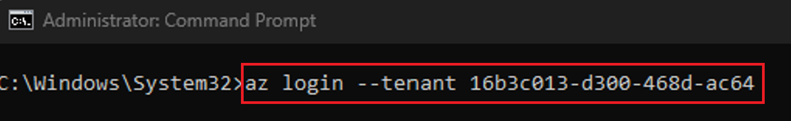

Once connected to the correct tenant, run the following command (Here we will use one of the consumer groups we created earlier):

az IoT hub monitor-events -n {iothub_name} -d {device_id} -g {resource_group} --cg {consumer_group_name}

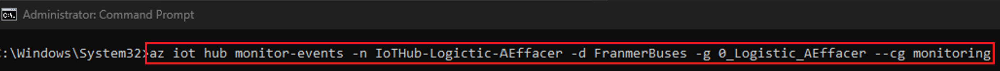

If all goes well, once the Azure CLI command is executed you should see the events that enter Azure IoT Hub:

#### Azure IoT Explorer

You can also monitor incoming events with Azure IoT Explorer:

## Event Processing

Now that the events are ingested into Azure IoT hub, we'll retrieve them for action.

### SignalR

The Azure SignalR service simplifies the process of adding real-time web capabilities to applications over HTTP. This real-time feature allows the service to send content updates to connected clients, such as a web or mobile app. Therefore, clients are updated without having to query the server or send new HTTP update requests.

From the Azure portal, click "*Create a resource*"

Then search for the SignalR service:

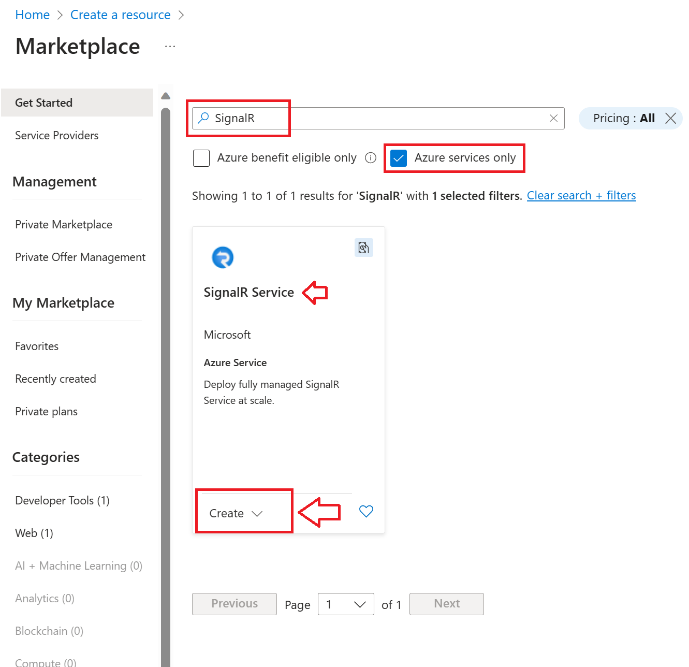

Fill in the information to create your service. Choose the resource group where you want to deploy the service.
To try, you can choose the "*Free*" tier.

Choose "***Serverless***" for the service mode.

Click on "*Review + create*"

Validate the creation of the service by clicking on the "*Create*" button

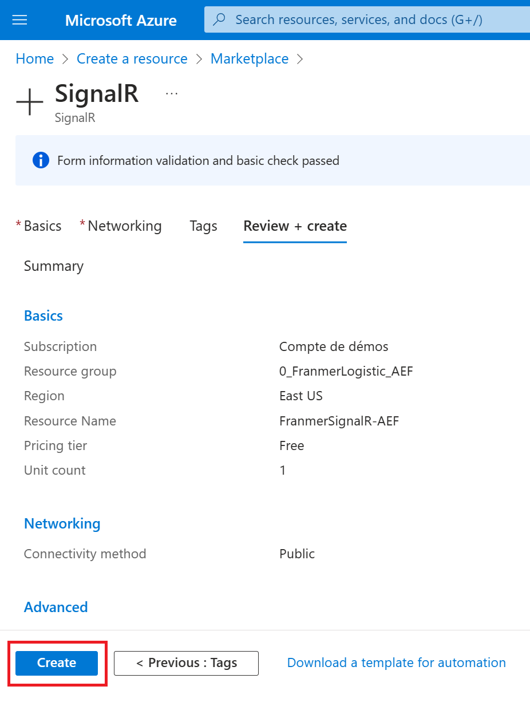

You should now have 2 services in your resource group:

Click your SignalR service, then click "*Connection strings*" to retrieve the connection string. Copy it and paste it into a file. We will need it a little later.

### Azure Function

Nous allons maintenant créer une "*Azure Function App*" pour récupérer les évènements d'Azure IoT hub et assurer la communication en temps réel avec Azure Maps (que l'on déploiera un peu plus tard)

Depuis le portail Azure, creez une nouvelle ressource et cherchez "*Function App*" :

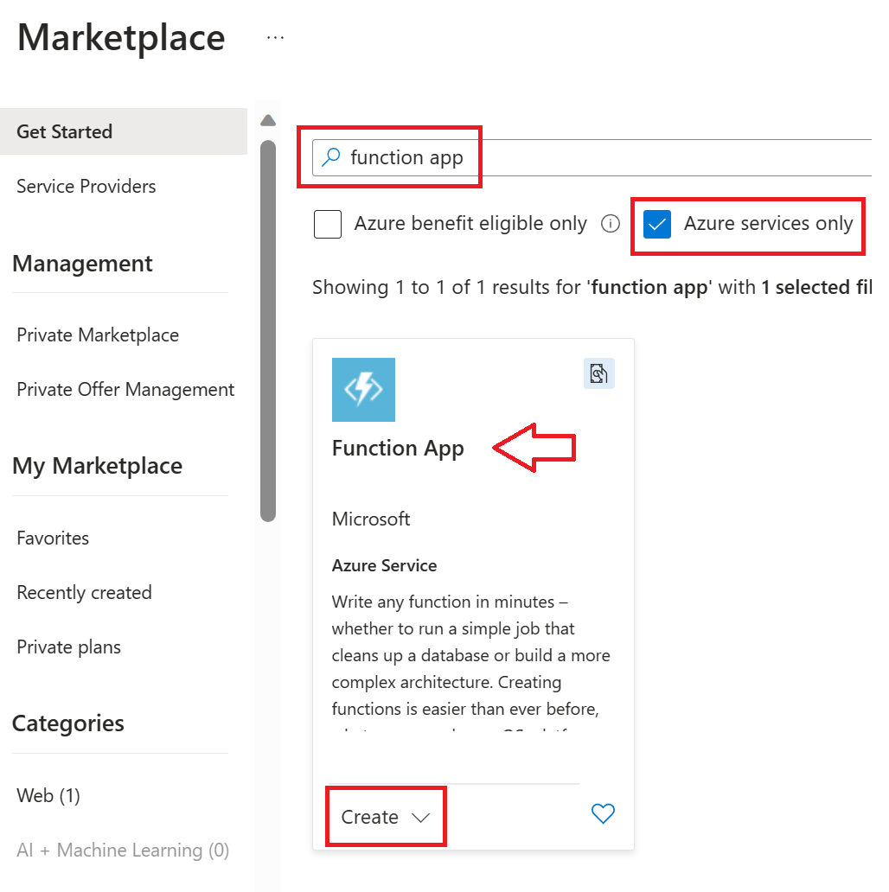

Définissez les options comme illustré sur la copie d'écran ci-dessous et cliquez sur "*Review + create*", puis validez la création de la "*Function App*" :

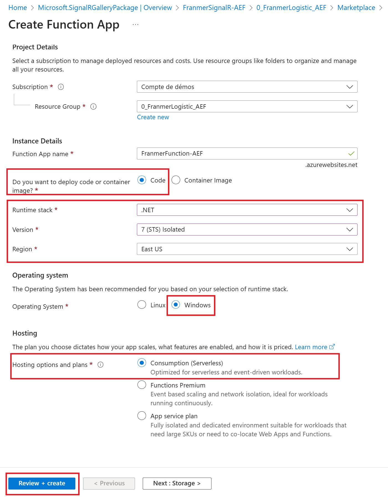

Depuis le portail Azure, allez dans votre groupe de ressources et cliquez sur la "*Function App*" nouvellement déployée :

Puis cliquez sur "Configuration. Dans "application settings" cliquez sur "New Application setting"

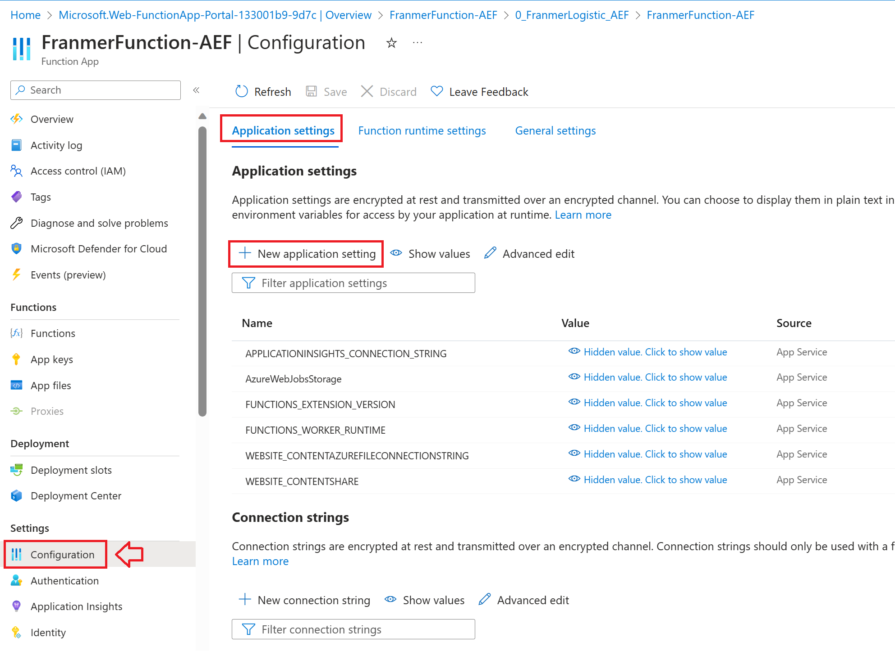

Rajoutez les valeurs :

- AzureIOTHubConnectionString
- AzureSignalRConnectionString

Pour la valeur "*AzureIOTHubConnectionString*" renseignez la valeur de la chaîne de connexion pour IoT Hub (*Event Hub-compatible endpoint*) :

Pour la valeur "*AzureSignalRConnectionString*" renseignez la chaîne de connexion du service SignalR : 

N'oubliez pas de sauvegarder vos modifications en cliquant sur le bouton "*Save*" :

#### Deploiement du code

Nous allons déployer le code des fonctions depuis Visual Studio Code. Avant toute chose, vérifiez que vous êtes bien connectez à Azure :

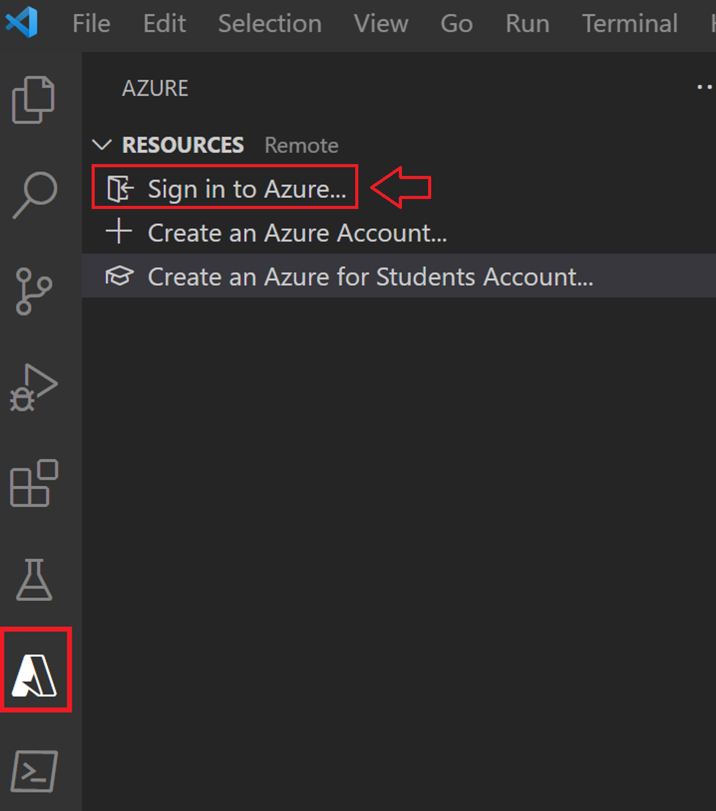

Une fois connecté, vous devriez voir vos ressources Azure :

le code se trouve dans le dossier "*Functions*". C'est le fichier "*FranmerRealTimeLogistic.cs*". Cliquez sur le fichier, puis depuis la palette de commandes (Ctrl + Shift + P), sélectionnez "*Azure Functions: Deploy to Function App...*" 

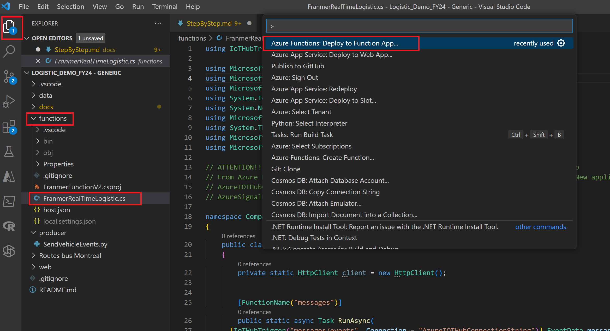

Puis sélectionnez votre "*Function App*" :

Validez la mise à jour :

Si tout se passe bien, vous devriez obtenir ce message à la fin du déploiement :

Et vous devriez voir vos 2 fonctions déployées dans Azure :

## Servir et présenter

Maintenant nous allons déployer les services pour servir et présenter les informations

### Azure Maps

Azure Maps est une collection de services géospatiaux et de kits de développement logiciel (SDK) qui utilisent des données cartographiques actualisées pour fournir un contexte géographique précis à des applications web et mobiles. Azure Maps fournit les services suivants :

- API REST pour assurer le rendu de cartes vectorielles et raster dans plusieurs styles et une imagerie satellitaire.
- Services de créateur pour créer et afficher des cartes basées sur des données de carte d’intérieur privées.
- Services Search pour localiser les adresses, les lieux et les points d’intérêt dans le monde entier.
- Diverses options de routage : point à point, multipoint, optimisation multipoint, isochrone, véhicule électrique, véhicule commercial, trafic influencé et routage par matrice.
- Vue du flux de trafic et vue des incidents pour les applications qui ont besoin d’informations de trafic en temps réel.
- Services de fuseau horaire (*Time zone*) et de géolocalisation (*Geolocation*).
- Services de *geofencing* et stockage des données cartographiques, avec les informations d’emplacement hébergées dans Azure.
- Intelligence géographique via l’analytique géospatiale.

La solution Azure Maps présentée ici inclus le clustering et les pop-ups dynamiques.

#### Déploiement d'Azure Maps

Depuis le portail Azure, créez une nouvelle ressource et cherchez Azure Maps. Cliquez sur "*Create*" :

Renseignez les informations nécessaires. Pour le niveau de prix, choisissez "*Gen2 (Maps and Location Insights)*" : 

Une fois le service déployé, depuis le portail Azure, cliquez sur votre service Azure Maps, puis cliquez sur "*Authentication*". Copiez la clef primaire du service et copiez là dans un fichier. On en aura besoin un peu plus tard :

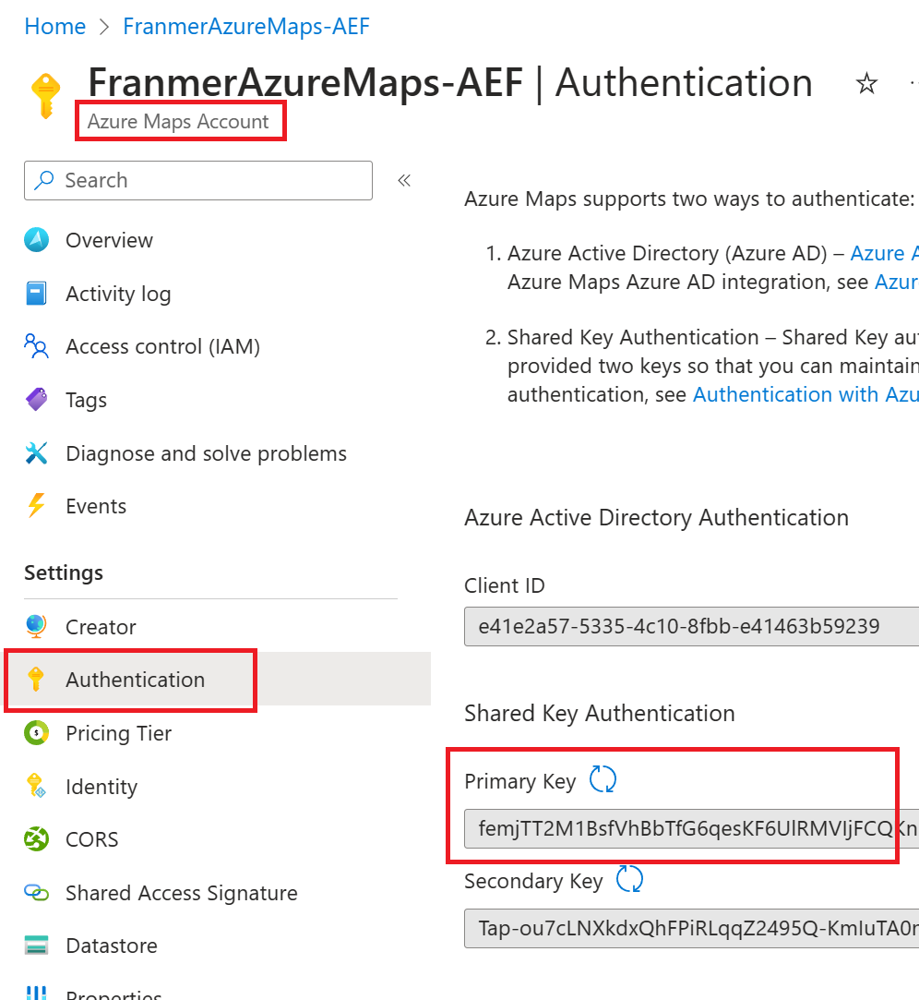

### Azure Web App

Azure App Service est un service HTTP pour l’hébergement d’applications web, d’API REST et de backends mobiles. Vous pouvez développer dans votre langage de prédilection, à savoir .NET, .NET Core, Java, Node.js, PHP et Python. Les applications s’exécutent et sont mises à l’échelle facilement dans les environnements Windows et Linux.

#### Déploiement Azure Web App

Depuis le portail Azure, créez une nouvelle ressource et cherchez pour Azure Web App :

Renseignez les informations nécessaires. Pour les champs suivants, définissez les valeurs comme indiqué ci-dessous :

- Publish : "Code"
- Runtime stack : "PHP 8.2"
- Pricing plan : "Free"

Cliquez sur "Review + Create" et validez la création du service :

Une fois le service déployé, allez sur la page "Overview" de votre service Azure Web App et copiez la valeur "*Default Domain*". Copiez cette valeur dans un fichier, nous en auront besoin un peu plus tard :

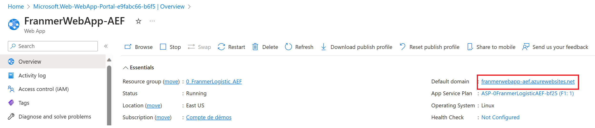

### Déploiement

Une fois tous les services Azure déployés, vous devriez avoir les services suivants dans votre groupe de ressources :

#### Définition du CORS de l'Azure Function

Afin de permettre au Service Azure Maps de communiquer avec les fonctions Azure, il reste un dernier paramétrage à faire au niveau de l'Azure "*Function App*".

Au niveau de votre "*Function App*", cliquez sur "*CORS*" ("Cross-Origin Resource Sharing") et rajoutez l'URL de votre application web que vous avez copié précédemment :

#### Modification du code de l'application web

Depuis Visual Studio Code, vérifiez que vous avez bien le complément "*Azure App Service*" :

Revenez dans la partie "*Explorer*" de Visual Studio Code, dans le dossier "*Web*" cliquez sur le fichier "*Index.html*". Remplacez les valeurs suivantes :

- baseurl (l'url de votre Azure Function App)
- subscriptionKey (la clef de votre service Azure Maps)

Par exemple vous devriez obtenir quelque chose comme ci-dessous après modifications :

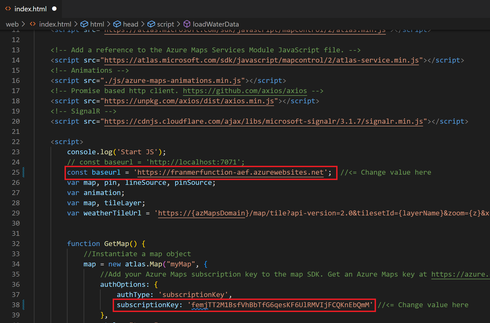

De plus, changez les références, avec l'url de votre application web, vers les images ou les services, là où c'est approprié, comme illustré ci-dessous :

Pour les images :

Pour les fonctionnalités :

#### déploiement de l'application web

Depuis Visual Studio Code, dans la partie Azure, vérifiez que vous avez bien accès à votre application web.

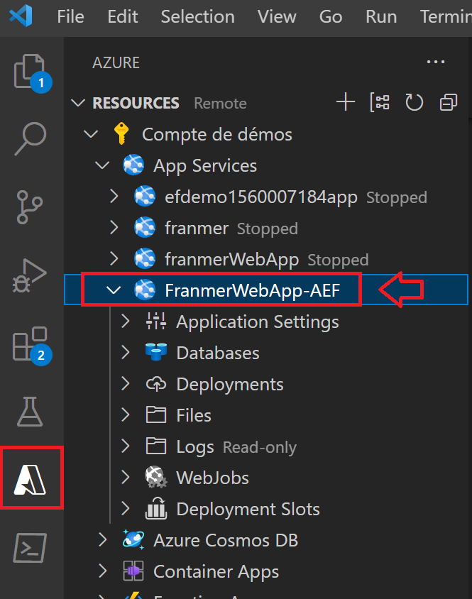

Faites un clic-droit sur votre application web et cliquez sur "*Deploy to Web App...*" :

La palette de commandes va s'ouvrir en haut de l'écran. Cliquez sur "*Browse...*" pour sélectionner le dossier que vous souhaitez déployer :

Dans notre cas nous allons déployer le dossier "*Web*". **Double-cliquez** sur le dossier "*Web*" et cliquez sur "*Select*" :

Cliquez sur "*Deploy*" :

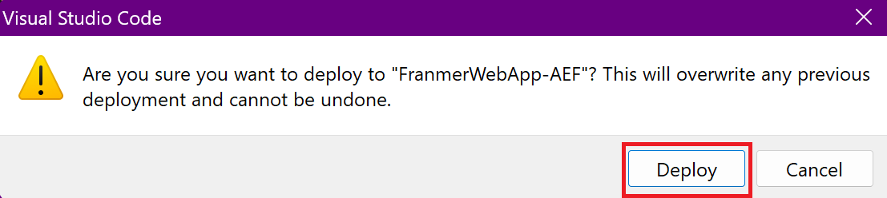

Si tout se passe bien, vous devriez avoir le message ci-dessous en bas à droite de votre écran. Cliquez sur "*Browse Website*" :

Vous devez avoir un nouvel onglet qui s'ouvre dans votre navigateur web affichant une carte centrée sur Montréal :

#### Suivre les bus en temps réels

Nous allons maintenant envoyer des évènements à IoT Hub pour les afficher en presque temps réel sur notre carte Azure Maps.

Dans l'explorateur de fichiers de Visual Studio Code, cliquez sur "*SendVehicleEvents.py*" qui se trouve dans le dossier "*producer*". Cliquez sur le bouton "*play*" qui se trouve en haut à droite de l'écran :

Vous devriez voir les évènements s'afficher dans la console :

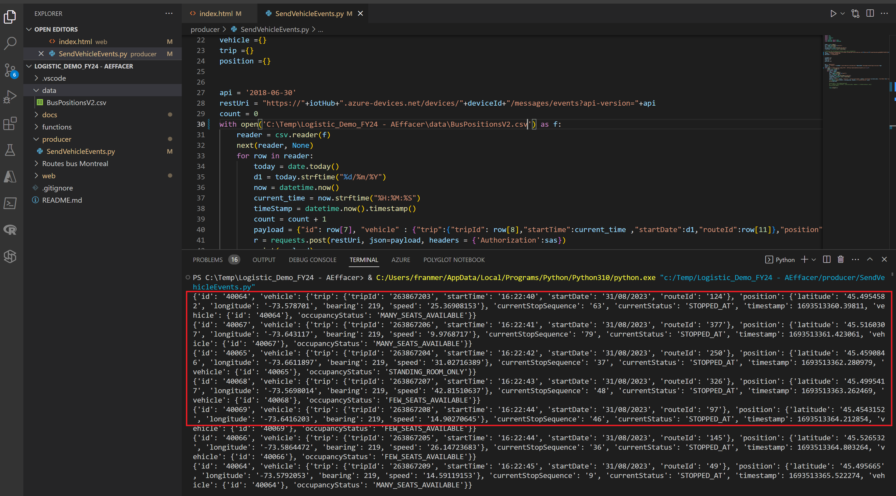

Vous devriez voir les bus commencer à bouger sur la carte :

Ci-dessous un petit Gif animé pour illustrer la solution avec le clustering, la gestion des couleurs en fonction des évènements et les pop-ups dynamiques :

## Comment débugguer

Après avoir publié votre page web, dans votre navigateur web, appuyez sur la touche **F12** et analysez les erreurs retournées.

Ci-dessous un exemple des erreurs communes avec une mauvaise référence des images et une mauvaise configuration des "*applications settings*" au niveau d'Azure "*Function App*" :

