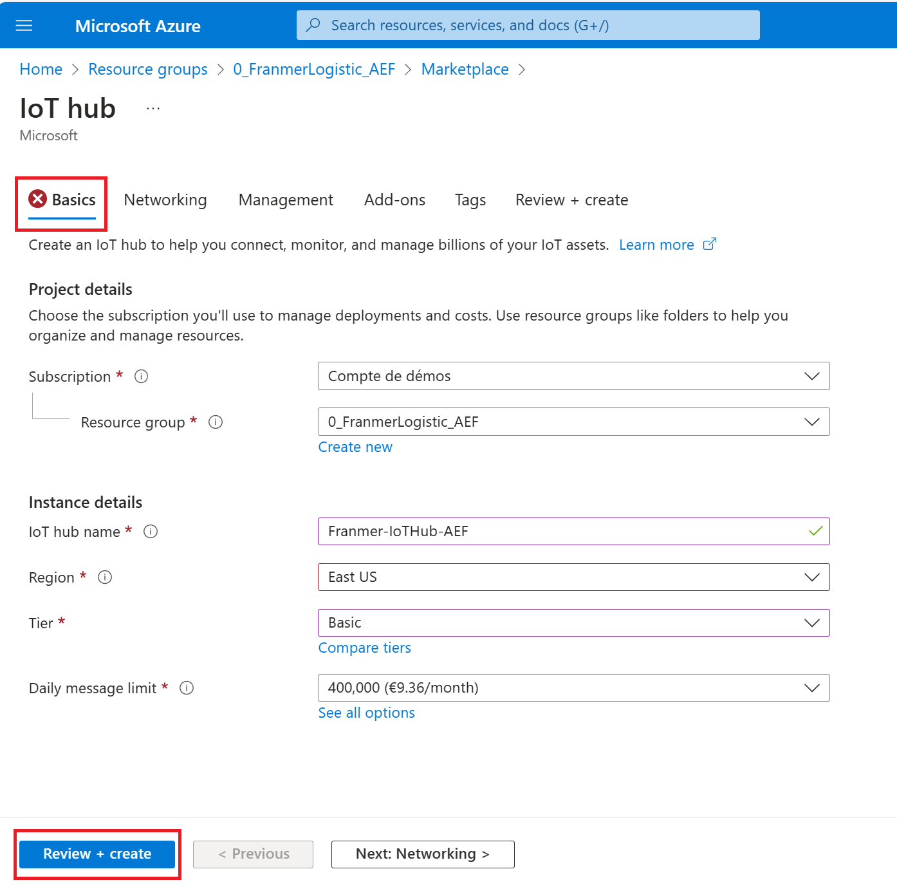
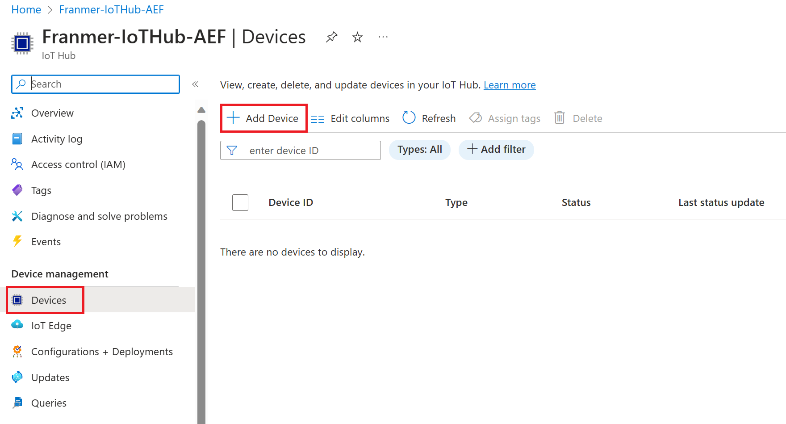
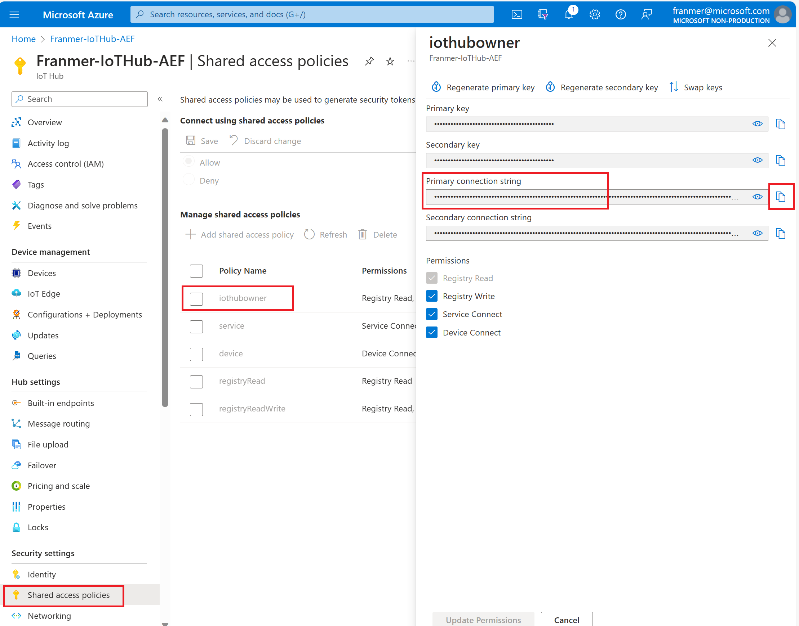
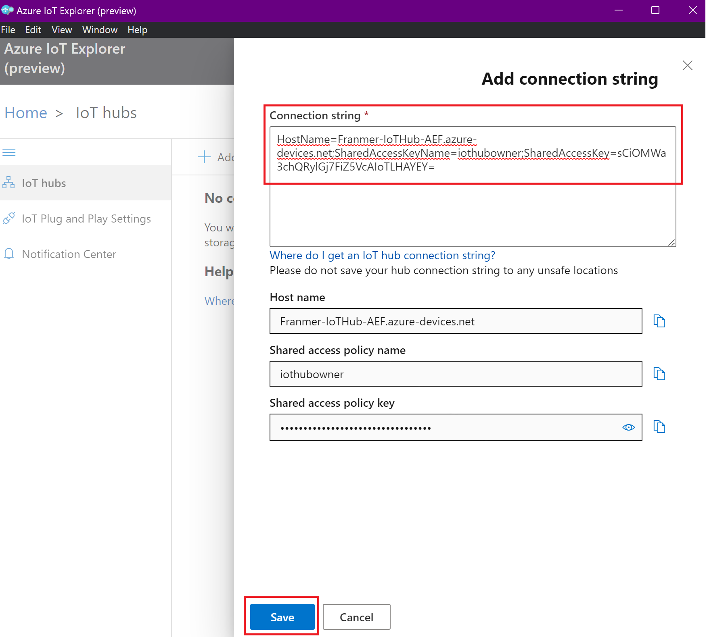

# Suivi logistique en temps réel

Dans cet article, je vais vous présenter les étapes pour mettre en place, de bout en bout, une solution de suivi d'une flotte de véhicules en temps réel. 

Après avoir suivi cet article, vous aurez une solution complète comme illustré dans le gif animé ci-dessous :

## Prérequis

- Une [souscription](https://azure.microsoft.com/en-ca/free/) Azure
- [Visual Studio Code](https://code.visualstudio.com/download)
- [Azure CLI](https://docs.microsoft.com/en-us/cli/azure/install-azure-cli)
- [IoT Explorer](https://github.com/Azure/azure-iot-explorer/releases)

## Ingestion

La première étape consiste à ingérer les données dans notre solution. IoT Hub est le service utilisé pour recevoir des événements et permettre à d'autres services Azure de s’abonner et recevoir ces événements. Un événement est simplement un ensemble de données, qui dans notre cas est représenté les informations des véhicules (id, emplacement, occupation, état du transit,....)

### IoT Hub

Depuis le [portail Azure](https://portal.azure.com), dans la place de marché, recherchez le service Azure IoT Hub, puis cliquez sur "*Create*" :

Renseignez les informations. Le tier basic sera suffisant ici. Il pourra cependant être augmenté ultérieurement en fonction des besoins.

Cliquez sur "*Review + Create*" puis validez la création du service :

Une fois le service créé, rendez-vous sur sa page "*Overview*" et mettez tout de suite à jour le certificat. Cliquez sur le lien "*What do I need to do?*" :

CLiquez sur le bouton "*Migrate to DigiCert Global G2*" :

Puis cochez les 4 cases avant de cliquer sur le bouton "*Update*" :

.

#### Création d'un appareil

Au niveau de votre service Azure IoT Hub, sur la gauche, cliquez sur "*Devices*" puis sur "*Add Device*"

Donnez un nom à l'appareil, choisissez "*Symetric key*", cochez la case "*Auto-generate keys*" et vérifiez que l'option "*Enable*" est bien sélectionnée.

Cliquez sur "*Save*"

Cliquez sur "*Refresh*" pour voir votre appareil dans la liste

#### Création des groupes de consommateurs

Les groupes de consommateurs sont une vue d’État du hub. Ils permettent à plusieurs applications consommatrices d’avoir chacune leur propre vue du flux d’événements et de lire le flux indépendamment. Cela signifie que lorsqu’une application cesse de lire à partir d’un flux d’événements, elle peut continuer là où elle s’est arrêtée. Il est préférable pour chaque application d’avoir son propre groupe de consommateurs.

Sur la gauche, cliquez sur "Built-in endpoints", puis créez vos groupes de consommateurs.

Copiez la chaîne de connexion "*Event Hub-compatible endpoint*" et conservez là dans un tableau. On s'en servira un peu plus tard.

#### Création d'un "*SAS TOKEN*"

Pour se connecter à notre IoT Hub avec IoT Explorer nous avons besoin d'une chaîne de connexion.

Sur la gauche cliquez sur "*Shared access policies*", "*iothubowner*", puis copiez une des chaînes de connexion.

Pour la création du jeton de connexion, nous allons utiliser [IoT Explorer](https://github.com/Azure/azure-iot-explorer/releases).

Exécutez IoT Explorer et cliquez sur "*Add connection*" :

Collez la chaîne de connexion puis cliquez sur "*Save*" :

Vous devez alors voir les appareils présents dans votre IoT Hub. Cliquez sur un des appareils :

Dans la section "*Connection string with SAS token*", choisissez "*Primary key*", définissez le nombre de minutes (525 600 minutes = 1 an) pour l'expiration du jeton, puis cliquez sur "*Generate*".

Vous allez obtenir un jeton ressemblant à celui ci-dessous :

*HostName=IoTHub-Logictic-AEffacer.azure-devices.net;DeviceId=FranmerBuses;SharedAccessSignature=SharedAccessSignature sr=IoTHub-Logictic-AEffacer.azure-devices.net%2Fdevices%2FFranmerBuses&sig=Qq0GFga6kzgwHp0DldvpJbR1mwAwXMOAm6Lmc9UFBhQ%3D&se=2392799555*

**Conservez uniquement la portion commençant par "*SharedAccessSignature sr=*" comme illustré ci-dessous :**

*SharedAccessSignature sr=IoTHub-Logictic-AEffacer.azure-devices.net%2Fdevices%2FFranmerBuses&sig=Qq0GFga6kzgwHp0DldvpJbR1mwAwXMOAm6Lmc9UFBhQ%3D&se=2392799555*

Copiez la portion ainsi générée puis collez-là. Nous allons en avoir besoin plus tard.

#### Envoyer des évènements à Azure IoT Hub

Depuis Visual Studio code, ouvrez le fichier "*SendVehicleEvent.py*" puis renseignez les champs requis.

Pour la valeur "*YOUR FILE PATH*", allez dans le "*data*", puis faîtes un clic-droit sur le fichier "*BusPositionV2.csv*" et cliquez sur "*Copy Path*" :

Après modification, vous devriez obtenir quelque chose comme illustré ci-dessous :

Une fois les modifications faîtes, exécutez le code. Si tout va bien vous devez voir les évènements dans le terminal :

#### Vérification des évènements envoyés

Nous allons vérifier que les évènements arrivent bien dans notre Azure IoT Hub

##### Avec Azure CLI

Ouvrez une fenêtre "Command prompt" puis connectez-vous sur le bon tenant Azure avec la commande suivante :

az login --tenant <Your Tenant ID>

Une fois connecté au bon tenant, exécutez la commande suivante (Nous allons utiliser ici un des groupes de consommateurs que nous avons créés précédemment):

az iot hub monitor-events -n {iothub_name} -d {device_id} -g {resource_group} --cg {consumer_group_name}

Si tout va bien, une fois la commande Azure CLI exécutée vous devriez voir les évènements qui entrent dans Azure IoT Hub :

#### Azure IoT Explorer

Il est aussi possible de surveiller les évènements entrant avec Azure IoT Explorer :

## Traitement des évènements

Maintenant que les évènements sont ingérés dans Azure IoT hub, nous allons les récupérer pour les exploiter.

### SignalR

Le service Azure SignalR simplifie le processus d’ajout de fonctionnalités web en temps réel aux applications par HTTP. Cette fonctionnalité en temps réel permet au service d’envoyer des mises à jour de contenu aux clients connectés, comme une application web ou mobile. Par conséquent, les clients sont mis à jour sans avoir à interroger le serveur ni à envoyer de nouvelles requêtes HTTP de mise à jour.

Depuis le portail Azure, cliquez sur "*Create a resource*"

Puis recherchez le service SignalR :

Renseignez les informations pour créer votre service. Choisissez le groupe de ressources dans lequel vous souhaitez déployer le service.
Pour faire des essais, vous pouvez choisir le tier "*Free*".

Choisissez "***Serverless***" pour le mode de service.

Cliquez sur "*Review + create*"

Validez la création du service en cliquant sur le bouton "*Create*"

Vous devriez maintenant avoir 2 services dans votre groupe de ressources :

Cliquez sur votre service SignalR, puis sur "*Connection strings*" pour récupérer la chaîne de connexion. Copiez là et collez là dans un fichier. On en aura besoin un peu plus tard.

### Azure Function

Nous allons maintenant créer une "*Azure Function App*" pour récupérer les évènements d'Azure IoT hub et assurer la communication en temps réel avec Azure Maps (que l'on déploiera un peu plus tard)

Depuis le portail Azure, creez une nouvelle ressource et cherchez "*Function App*" :

Définissez les options comme illustré sur la copie d'écran ci-dessous et cliquez sur "*Review + create*", puis validez la création de la "*Function App*" :

Depuis le portail Azure, allez dans votre groupe de ressources et cliquez sur la "*Function App*" nouvellement déployée :

Puis cliquez sur "Configuration. Dans "application settings" cliquez sur "New Application setting"

Rajoutez les valeurs :

- AzureIOTHubConnectionString
- AzureSignalRConnectionString

Pour la valeur "*AzureIOTHubConnectionString*" renseignez la valeur de la chaîne de connexion pour IoT Hub (*Event Hub-compatible endpoint*) :

Pour la valeur "*AzureSignalRConnectionString*" renseignez la chaîne de connexion du service SignalR : 

N'oubliez pas de sauvegarder vos modifications en cliquant sur le bouton "*Save*" :

#### Deploiement du code

Nous allons déployer le code des fonctions depuis Visual Studio Code. Avant toute chose, vérifiez que vous êtes bien connectez à Azure :

Une fois connecté, vous devriez voir vos ressources Azure :

le code se trouve dans le dossier "*Functions*". C'est le fichier "*FranmerRealTimeLogistic.cs*". Cliquez sur le fichier, puis depuis la palette de commandes (Ctrl + Shift + P), sélectionnez "*Azure Functions: Deploy to Function App...*" 

Puis sélectionnez votre "*Function App*" :

Validez la mise à jour :

Si tout se passe bien, vous devriez obtenir ce message à la fin du déploiement :

Et vous devriez voir vos 2 fonctions déployées dans Azure :

## Servir et présenter

Maintenant nous allons déployer les services pour servir et présenter les informations

### Azure Maps

Azure Maps est une collection de services géospatiaux et de kits de développement logiciel (SDK) qui utilisent des données cartographiques actualisées pour fournir un contexte géographique précis à des applications web et mobiles. Azure Maps fournit les services suivants :

- API REST pour assurer le rendu de cartes vectorielles et raster dans plusieurs styles et une imagerie satellitaire.
- Services de créateur pour créer et afficher des cartes basées sur des données de carte d’intérieur privées.
- Services Search pour localiser les adresses, les lieux et les points d’intérêt dans le monde entier.
- Diverses options de routage : point à point, multipoint, optimisation multipoint, isochrone, véhicule électrique, véhicule commercial, trafic influencé et routage par matrice.
- Vue du flux de trafic et vue des incidents pour les applications qui ont besoin d’informations de trafic en temps réel.
- Services de fuseau horaire (*Time zone*) et de géolocalisation (*Geolocation*).
- Services de *geofencing* et stockage des données cartographiques, avec les informations d’emplacement hébergées dans Azure.
- Intelligence géographique via l’analytique géospatiale.

La solution Azure Maps présentée ici inclus le clustering et les pop-ups dynamiques.

#### Déploiement d'Azure Maps

Depuis le portail Azure, créez une nouvelle ressource et cherchez Azure Maps. Cliquez sur "*Create*" :

Renseignez les informations nécessaires. Pour le niveau de prix, choisissez "*Gen2 (Maps and Location Insights)*" : 

Une fois le service déployé, depuis le portail Azure, cliquez sur votre service Azure Maps, puis cliquez sur "*Authentication*". Copiez la clef primaire du service et copiez là dans un fichier. On en aura besoin un peu plus tard :

### Azure Web App

Azure App Service est un service HTTP pour l’hébergement d’applications web, d’API REST et de backends mobiles. Vous pouvez développer dans votre langage de prédilection, à savoir .NET, .NET Core, Java, Node.js, PHP et Python. Les applications s’exécutent et sont mises à l’échelle facilement dans les environnements Windows et Linux.

#### Déploiement Azure Web App

Depuis le portail Azure, créez une nouvelle ressource et cherchez pour Azure Web App :

Renseignez les informations nécessaires. Pour les champs suivants, définissez les valeurs comme indiqué ci-dessous :

- Publish : "Code"
- Runtime stack : "PHP 8.2"
- Pricing plan : "Free"

Cliquez sur "Review + Create" et validez la création du service :

Une fois le service déployé, allez sur la page "Overview" de votre service Azure Web App et copiez la valeur "*Default Domain*". Copiez cette valeur dans un fichier, nous en auront besoin un peu plus tard :

### Déploiement

Une fois tous les services Azure déployés, vous devriez avoir les services suivants dans votre groupe de ressources :

#### Définition du CORS de l'Azure Function

Afin de permettre au Service Azure Maps de communiquer avec les fonctions Azure, il reste un dernier paramétrage à faire au niveau de l'Azure "*Function App*".

Au niveau de votre "*Function App*", cliquez sur "*CORS*" ("Cross-Origin Resource Sharing") et rajoutez l'URL de votre application web que vous avez copié précédemment :

#### Modification du code de l'application web

Depuis Visual Studio Code, vérifiez que vous avez bien le complément "*Azure App Service*" :

Revenez dans la partie "*Explorer*" de Visual Studio Code, dans le dossier "*Web*" cliquez sur le fichier "*Index.html*". Remplacez les valeurs suivantes :

- baseurl (l'url de votre Azure Function App)
- subscriptionKey (la clef de votre service Azure Maps)

Par exemple vous devriez obtenir quelque chose comme ci-dessous après modifications :

De plus, changez les références, avec l'url de votre application web, vers les images ou les services, là où c'est approprié, comme illustré ci-dessous :

Pour les images :

Pour les fonctionnalités :

#### déploiement de l'application web

Depuis Visual Studio Code, dans la partie Azure, vérifiez que vous avez bien accès à votre application web.

Faites un clic-droit sur votre application web et cliquez sur "*Deploy to Web App...*" :

La palette de commandes va s'ouvrir en haut de l'écran. Cliquez sur "*Browse...*" pour sélectionner le dossier que vous souhaitez déployer :

Dans notre cas nous allons déployer le dossier "*Web*". **Double-cliquez** sur le dossier "*Web*" et cliquez sur "*Select*" :

Cliquez sur "*Deploy*" :

Si tout se passe bien, vous devriez avoir le message ci-dessous en bas à droite de votre écran. Cliquez sur "*Browse Website*" :

Vous devez avoir un nouvel onglet qui s'ouvre dans votre navigateur web affichant une carte centrée sur Montréal :

#### Suivre les bus en temps réels

Nous allons maintenant envoyer des évènements à IoT Hub pour les afficher en presque temps réel sur notre carte Azure Maps.

Dans l'explorateur de fichiers de Visual Studio Code, cliquez sur "*SendVehicleEvents.py*" qui se trouve dans le dossier "*producer*". Cliquez sur le bouton "*play*" qui se trouve en haut à droite de l'écran :

Vous devriez voir les évènements s'afficher dans la console :

Vous devriez voir les bus commencer à bouger sur la carte :

Ci-dessous un petit Gif animé pour illustrer la solution avec le clustering, la gestion des couleurs en fonction des évènements et les pop-ups dynamiques :

## Comment débugguer

Après avoir publié votre page web, dans votre navigateur web, appuyez sur la touche **F12** et analysez les erreurs retournées.

Ci-dessous un exemple des erreurs communes avec une mauvaise référence des images et une mauvaise configuration des "*applications settings*" au niveau d'Azure "*Function App*" :

