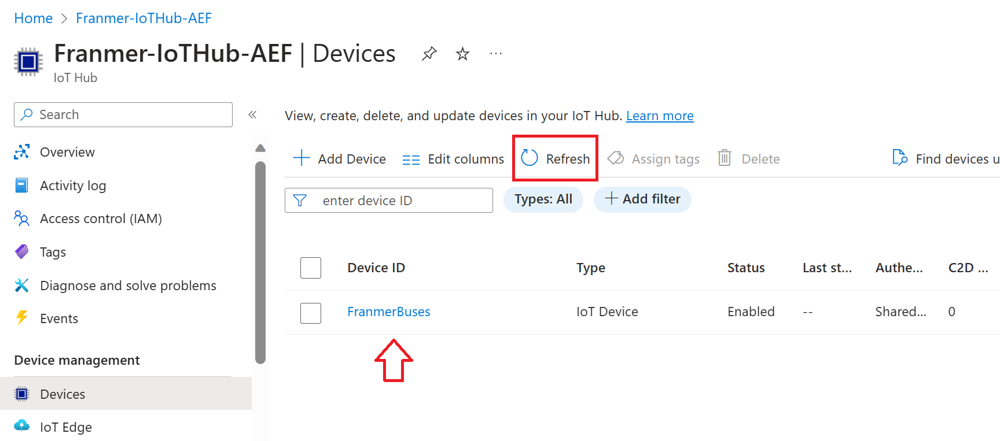
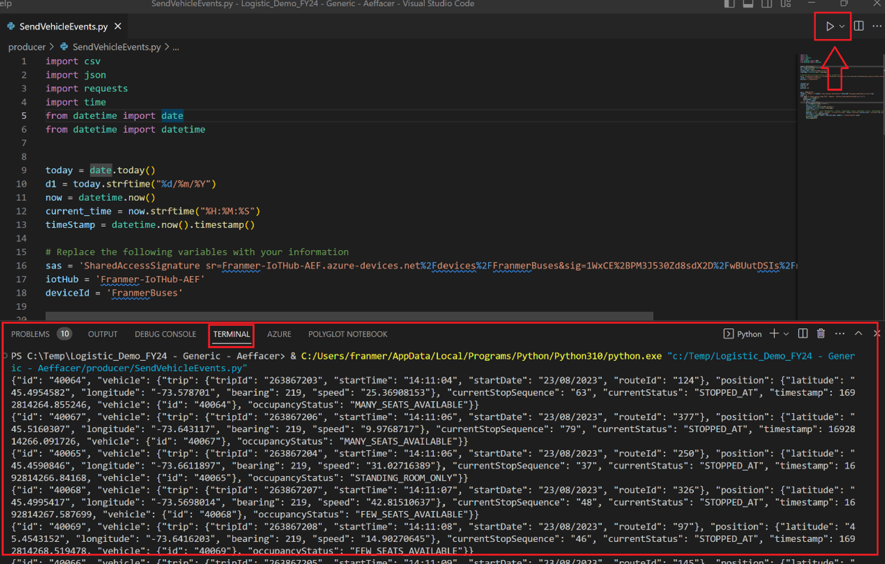
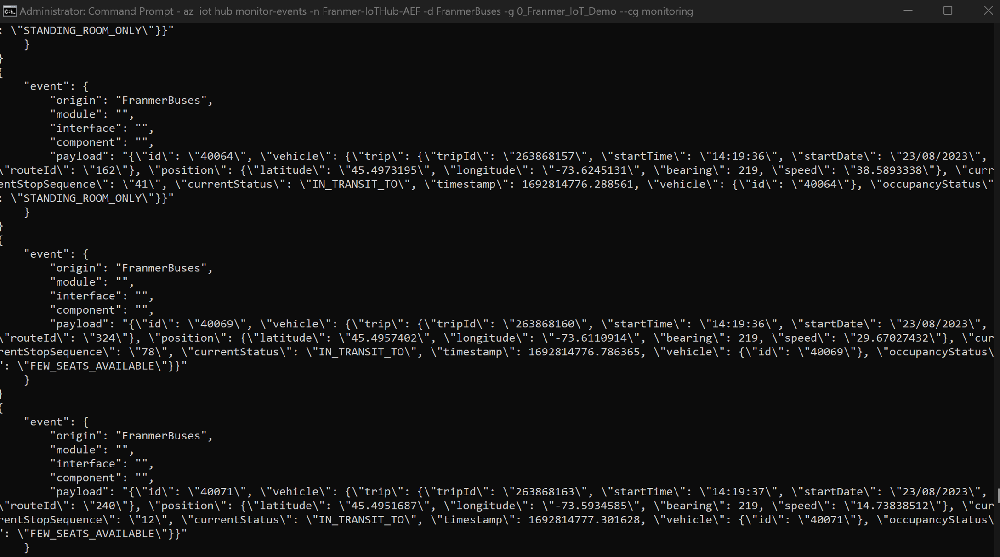
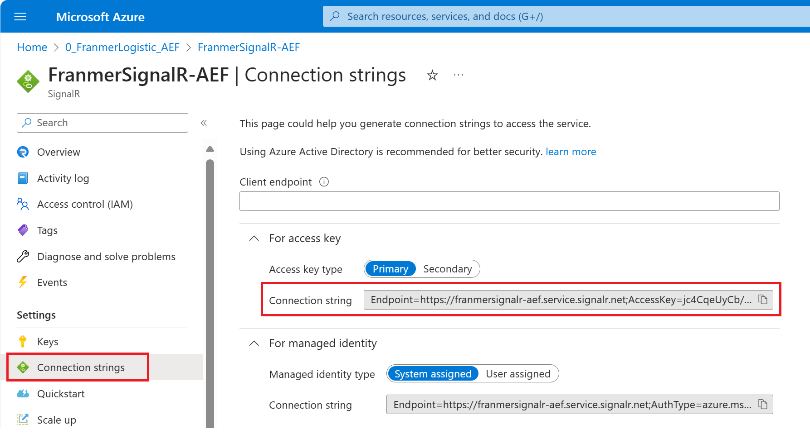
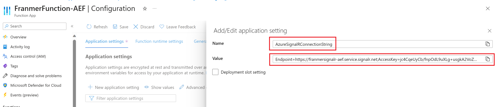
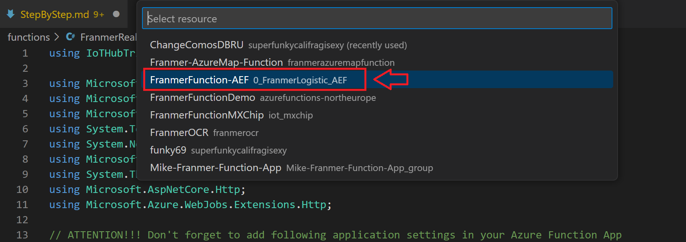
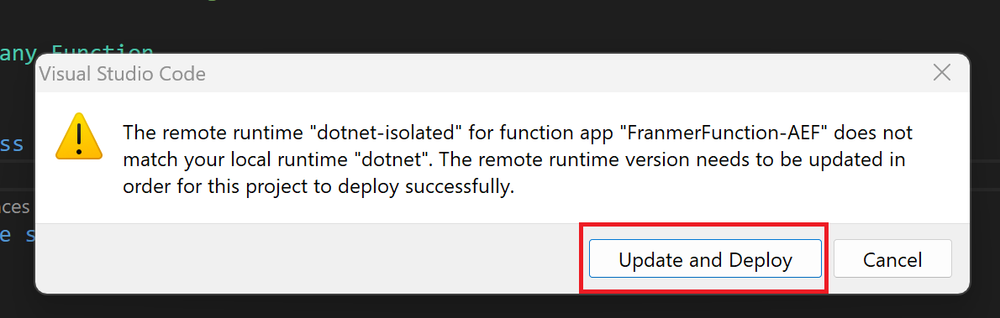

# Suivi logistic en temps réel

Dans cet article, je vais vous présenter les étapes pour mettre en place, de bout en bout, une solution de suivie d'une flotte de véhicules en temps réel. 

## Prérequis

- Une [souscription](https://azure.microsoft.com/en-ca/free/) Azure
- [Visual Studio Code](https://code.visualstudio.com/download)
- [Azure CLI](https://docs.microsoft.com/en-us/cli/azure/install-azure-cli)
- [IoT Explorer](https://github.com/Azure/azure-iot-explorer/releases)

## Ingestion

La première étape consiste à ingérer les données dans notre solution. IoT Hub est le service utilisé pour recevoir des événements et permettre à d'autres services Azure de s’abonner et recevoir ces événements. Un événement est simplement un ensemble de données, qui dans notre cas est représenté les informations des véhicules (id, emplacement, occupation, état du transit,....)

### IoT Hub

Depuis le [portail Azure](https://portal.azure.com), dans la place de marché, recherchez le service Azure IoT Hub, puis cliquez sur "*Create*" :

Renseignez les informations. Le tier basic sera suffisant ici. Il pourra cependant être augmenté ultérieurement en fonction des besoins.

Cliquez sur "*Review + Create*" puis validez la création du service :

Une fois le service créé, rendez-vous sur sa page "*Overview*" et mettez tout de suite à jour le certificat. Cliquez sur le lien "*What do I need to do?*" :

CLiquez sur le bouton "*Migrate to DigiCert Global G2*" :

Puis cochez les 4 cases avant de cliquez sur le bouton "Update" :

.

#### Creation d'un appareil

Au niveau de votre service Azure IoT Hub, sur la gauche, cliquez sur "*Devices*" puis sur "*Add Device*"

Donnez un nom à l áppareil, choisissez "*Symetric key*", cochez la case "*Auto-generate keys*" et vérifiez que l'option "*Enable*" est bien sélectionnée.

Cliquez sur "*Save*"

Cliquez sur "*Refresh*" pour voir votre appareil dans la liste

#### Création des groupes de consommateurs

Les groupes de consommateurs sont une vue d’État du hub. Ils permettent à plusieurs applications consommatrices d’avoir chacune leur propre vue du flux d’événements et de lire le flux indépendamment. Cela signifie que lorsqu’une application cesse de lire à partir d’un flux d’événements, elle peut continuer là où elle s’est arrêté. Il est préférable pour chaque application d’avoir son propre groupe de consommateurs.

Sur la gauche, cliquez sur "Built-in endpoints", puis créez vos groupes de consommateurs.

Copiez la chaîne de connection "*Event Hub-compatible endpoint*" et conservez là dans un tableau. On s'en servira un peu plus tard.

#### Creation d'un "SAS TOKEN"

Pour se connecter à notre IoT Hub avec IoT Explorer nous avons besoin d'une chaîne de connexion.

Sur la gauche cliquez sur "*Shared access policies*", "*iothubowner*", puis copiez une des chaînes de connexion.

Pour la création du jeton de connection, nous allons utiliser [IoT Explorer](https://github.com/Azure/azure-iot-explorer/releases).

Exécutez IoT Explorer et cliquez sur "Add connection" :

Collez la chaîne de connexion puis cliquez sur "Save"

Vous devez alors voir les appareils présents dans votre IoT Hub. Cliquez sur un des appareils :

Dans la section "Connection string with SAS token". choisissez "Primary key", définisez le nombre de minutes avec l'expiration du jeton puis cliquez sur "Generate".

Vous allez obtenir un jeton ressemblant à celui ci-dessous :

*HostName=IoTHub-Logictic-AEffacer.azure-devices.net;DeviceId=FranmerBuses;SharedAccessSignature=SharedAccessSignature sr=IoTHub-Logictic-AEffacer.azure-devices.net%2Fdevices%2FFranmerBuses&sig=Qq0GFga6kzgwHp0DldvpJbR1mwAwXMOAm6Lmc9UFBhQ%3D&se=2392799555*

Conservez uniquement la portion commençant par "*SharedAccessSignature sr=*" comme illustré ci-dessous :

*SharedAccessSignature sr=IoTHub-Logictic-AEffacer.azure-devices.net%2Fdevices%2FFranmerBuses&sig=Qq0GFga6kzgwHp0DldvpJbR1mwAwXMOAm6Lmc9UFBhQ%3D&se=2392799555*

Copiez la portion ainsi genérée puis collez-là. Nous allons en avoir besoin plus tard.

#### Envoyer des évènements à Azure IoT Hub

Depuis Visual Studio code, ouvrez le fichier "*SendVehicleEvent.py*" puis renseignez les champs requis.

Pour la valeur "*YOUR FILE PATH*", allez dans le "*data*", puis faîtes un clique droit sur le fichier "BusPositionV2.csv" et cliquez sur "*Copy Path*" :

Après modification, vous devriez obtenir quelque chose comme illustré ci-dessous :

Une fois les modifications faîtes, exécutez le code. Si tout va bien vous devez voir les évènements dans le terminal :

#### Vérification des évènements envoyés

Nous allons vérifier que les évènements arrivents bien dans notre Azure IoT Hub

##### Avec Azure CLI

Ouvrez une fenêtre "Command prompt" puis connectez-vous sur le bon tenant Azure avec la commande suivante :

az login --tenant <Your Tenant ID>

Une fois connecté au bon tenant, exécutez la commande suivante (Nous allons utiliser ici un des groupes de consommateurs que nous avons créés précédement):

az iot hub monitor-events -n {iothub_name} -d {device_id} -g {resource_group} --cg {consumer_group_name}

Si tout va bien, une fois la commande Azure CLI exécutée vous devriez voir les évènements qui entrent dans Azure IoT Hub :

#### Azure IoT Explorer

Il est aussi possible de surveiller les évènements entrant avec Azure IoT Explorer :

## Traitement des évènements

Maintenant que les évènements sont ingérés dans Azure IoT hub, nous allons les récupérer pour les exploiter.

### SignalR

Le service Azure SignalR simplifie le processus d’ajout de fonctionnalités web en temps réel aux applications par HTTP. Cette fonctionnalité en temps réel permet au service d’envoyer des mises à jour de contenu aux clients connectés, comme une application web ou mobile monopage. Par conséquent, les clients sont mis à jour sans avoir à interroger le serveur ni à envoyer de nouvelles requêtes HTTP de mise à jour.

Depuis le portail Azure, cliquez sur "*Create a resource*"

Puis recherchez le service SignalR

Renseignez les informations pour créer votre service. Choisissez le groupe de ressources dans lequel vous souhaitez déployer le service.
Pour faire des essais, vous pouvez choisir le tier "*Free*".

Choisissez "***Serverless***" pour le mode de service.

Cliquez sur "*Review + create*"

Validez la création du service en cliquant sur le bouton "*Create*"

Vous devriez maintenant avoir 2 services dans votre groupe de ressources :

Cliquez sur votre service SignalR, puis sur "*Connection strings*" pour récupérer la chaîne de connexion. Copiez là et collez là dans un fichier. On en aura besoin un peu plus tard.

### Azure Function

Nous allons maintenant créer une "*Azure Function App*" pour récupérer les évènements d'Azure IoT hub et assurer la communication en temps réel avec Azure Maps (que l'on déploira un peu plus tard)

Depuis le portail Azure, creez une nouvelle ressource et cherchez "*Function App*" :

Définissez les options comme illustré sur la copie d'écran ci-dessous et cliquez sur "*Review + create*", puis validez la création de la "*Function App*" :

Depuis le portail Azure, allez dans votre groupe de ressources et cliquez sur la "*Function App*" nouvellement déployée :

Puis cliquez sur "Configuration. Dans "application settings" cliquez sur "New Application setting"

Rajoutez les valeurs :

- AzureIOTHubConnectionString
- AzureSignalRConnectionString

Pour la valeur "*AzureIOTHubConnectionString*" renseignez la valeur de la chaîne de connection pour IoT Hub (Event Hub-compatible endpoint) :

Pour la valeur "*AzureSignalRConnectionString*" renseignez la chaîne de connexion du service SignalR : 

N'oubliez pas de sauvegarder vos modifications en cliquant sur le bouton "*Save*" :

#### Deploiement du code

Nous allons déployer le code des fonctions depuis Visual Studio Code. Avant toute chose, vérifiez que vous êtes bien connectez à Azure :

Une fois connecté, vous devriez voir vos ressources Azure:

le code se trouve dans le dossier "Functions". C'est le fichier "FranmerRealTimeLogistic.cs". Cliquez sur le fichier, puis depuis la palette de commandes (Ctrl + Shift + P), sélectionnez "*Azure Functions: Deploy to Function App...*" 

Puis sélectionnez votre "*Function App*" :

Validez la mise à jour :

Si tout se pasde bien, vous devriez obtenir ce message à la fin du déploiment :

